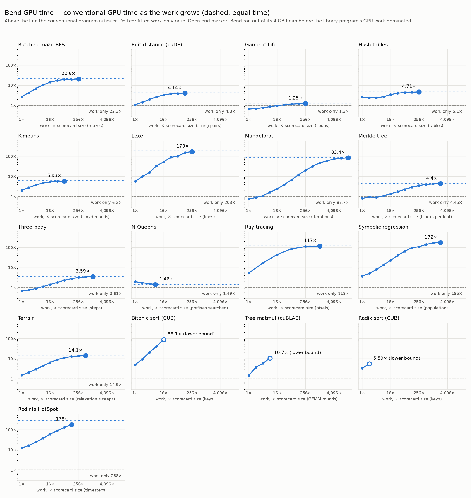

# bend-bench

The [Bend](https://github.com/bendlang/bend) programming language lets you run the same code in parallel on CPU and GPU. This benchmark compares performance with OpenMP on CPU and CUDA on GPU. Bend's main benefit is verifiability, being fast is just a perk.

## Benchmark choice

Performance depends much more on the implementation than the language it was written in. Comparing implementations across languages can be tricky, as each language allows different optimizations. We compare against existing benchmarks and new implementations as well.

We compare Bend’s 16 published workloads with added parallel baselines written by GPT-6-Astra in C and OpenMP.

Additional benchmarks are chosen to span a few interesting dimensions:
- Pricing and game search contrast predictable independent work with uneven, decision-dependent work.
- HotSpot and BFS contrast regular local communication with irregular shared-data access.
- Sorting and summation from NVIDIA’s [CUB](https://github.com/NVIDIA/cccl/tree/main/cub) library compare to highly optimized primitives.
- Machine learning from [bend-ml](ML.md) compares GPT-2 and nanoGPT inference, MNIST training and matrix products with [PyTorch](https://pytorch.org/).
- Unbalanced Tree Search from [BOTS](https://github.com/bsc-pm/bots) tests Bend's [documented limitation](https://github.com/bendlang/bend/blob/b9d1352c9f45632447f40a2e927355c92f2be58c/README.md#limitations) that "Parallelism requires balanced calls. Flexible parallelism will be added later."

## Results

### CPU

Across all workloads, moving from one to 16 CPU threads gives Bend a median 13× speedup, compared with 14× for the conventional programs. How Bend compares at 16 threads depends on what it's compared against. Against the same algorithm, in our OpenMP ports and the pricing and game-search controls, Bend takes a median 1.3× as long. It slightly beats OpenMP on Game of Life and tree matrix multiplication, and comes within 1.1–1.3× on seven others. Against established tuned code or a different algorithm, it takes a median 14× as long: GNU parallel sort, GAP's BFS, Rodinia's HotSpot, BOTS's UTS tasks and a fused summation loop. The sorting gap is algorithmic. Our OpenMP sorts call GNU parallel sort, which finishes over 100× faster than the serial C version, while Bend's sorts take about 1.3× serial C's time on one thread. [CPU results](PERFORMANCE.md).

On one CPU thread, Bend's median time is 1.2× the same algorithm's. It stays within 1.4× on 10 of those 15 workloads, beats serial C on Game of Life and tree matrix multiplication, and takes 1.7–3.7× as long on the rest. Against the tuned serial codes, HotSpot, summation and BFS take 17–22× as long.

Startup doesn't distort these CPU ratios. An empty Bend program runs in about 2 ms and an empty OpenMP program in about 5 ms, a few percent at most of all but the shortest 16-thread runs.

Irregular work is harder. Bend gains no CPU speedup on either UTS input. [UTS results](PERFORMANCE.md#uts-irregular-search).

### GPU

GPU comparisons need more care, because starting a GPU program takes much longer than starting a CPU one. Every run is a fixed cost, mostly startup, plus the time for the work itself, and a single timing mixes the two. At the scorecard sizes, the input sizes the scorecard runs, most conventional GPU programs spend under 10% of their run on the GPU, so comparing total times mostly compares startup.

To separate them, we grew one work knob per workload, like iterations, steps or lines, until the conventional program's GPU work dominated its run. We then fit each program's time as a fixed cost plus a work term. The fixed costs say who starts faster. The work terms say how much time each program adds per unit of work, and their ratio at the largest size changes by under 3% when that size is left out, on every workload except edit distance. [Startup scaling](STARTUP_SCALING.md).

Bend usually has the smaller fixed cost, 0.12–0.16 s against about 0.18 s. On Mandelbrot, Merkle trees, three-body simulation and Game of Life, the GPU work at the scorecard size is small enough that this decides the result: Bend finishes them sooner than our CUDA programs, and those wins end at 8× to 32× the work.

Per unit of work, Bend GPU takes a median 5.7× as long as the conventional GPU program. It's closest on Game of Life at 1.3×, N-Queens at 1.5×, game search at 1.8× and three-body at 3.6×, with pricing, edit distance, Merkle, hash tables and k-means at 4.0–6.2×. It's furthest on HotSpot at 290×, lexer at 200×, symbolic regression at 180×, ray tracing at 120× and Mandelbrot at 40×. The scorecard-size ratios understate most of these gaps, often by more than 20 times: lexer goes from 6.2× to 200× and Mandelbrot from 0.8× to 40×.


 [GPU results](VENDOR_CUDA_COMPLETION.md), [full scorecard](benchmarks/summary/index.html).

The library comparisons never get past startup. Bend's 4 GB heap runs out while CUB and cuBLAS still spend under 5% of their run on the GPU, so we only have lower bounds: at least 89× for bitonic sort against CUB, 11× for tree matrix multiplication against cuBLAS and 5.6× for radix sort against CUB. For summation, Bend finishes sooner below about 1 billion items, again due to faster startup, while CUB performs the calculation itself about 280× faster. [Summation results](runs/reduction-crossover-20260920/report.md).

The same correction applies to moving one Bend program from 16 CPU threads to the GPU. At the scorecard sizes, the GPU speeds up 11 of 21 workloads and slows down the other 10. Per unit of work, it's 24–61× faster than 16 threads on Mandelbrot, three-body, Game of Life and Merkle, and 1.1–2.0× faster on k-means, symbolic regression, terrain and edit distance. Ray tracing comes out even, and BFS, hash tables and lexer still take 1.3–2.4× longer on the GPU. This assumes the 16-thread CPU time grows in proportion to the work; we haven't measured the CPU beyond the scorecard size.

Option pricing on the GPU is 68× faster than on 16 CPU threads. Per path, our CUDA implementation is 4.0× faster than Bend GPU, while Bend finishes sooner below about 34× the scorecard's paths thanks to its smaller fixed cost. [Pricing results](PRICING_SUSTAINED.md). For alpha-beta game search, Bend GPU is 1.9× faster than Bend on 16 CPU threads. Our CUDA implementation is 3.7× faster than Bend GPU per batch, and 1.8× faster per position as a whole program that also writes out every answer. OpenMP on 16 CPU threads is 1.4× faster than Bend GPU. [Game-search results](MNK_HOST_ARRAY.md).

Gunrock finishes BFS sooner than Bend GPU on the two larger graphs, while Bend finishes sooner on the smallest. [BFS results](BFS_RESULTS.md).

On GPU, the unchanged Bend UTS port reaches the runtime's stack limit on both inputs. Our CUDA implementation completes the larger tree 6.5× faster than BOTS OpenMP on 16 CPU threads. [UTS GPU results](UTS_GPU.md).

### Machine learning

The machine-learning workloads come from [bend-ml](https://github.com/nuxyel/bend-ml), which writes neural networks in Bend with every tensor shape checked by the type system, and compare against PyTorch. They run a newer Bend, main at d5fe6566, and time the work after the weights and data are loaded.

Generating text from one prompt, Bend takes about 5× as long as PyTorch on GPT-2 small and on a model at [nanoGPT](https://github.com/karpathy/nanoGPT)'s character-level sizes, on one thread and on 16. bend-ml computes its matrix products one after another, so more threads don't help. Training is further behind: one MNIST epoch takes 74× as long on one thread and 41× on 16, where bend-ml's batched products run in parallel blocks and gain 3× from the extra threads. Its two product kernels on their own take 14–49× as long.

Inference in production runs on GPUs, in batches. Bend's GPU runs independent work in parallel, so we batched nanoGPT by giving each of 1,024 prompts its own generation over shared weights. On 16 CPU threads Bend takes 38× as long as PyTorch's batched pass. On the GPU it takes 193× as long as PyTorch on CUDA, 195 s against 1.0 s, and twice as long as Bend's own CPU: each GPU lane runs a whole generation alone, which takes about 195 s however many sequences run beside it. As the batch grows, Bend GPU overtakes Bend CPU between 2,048 and 4,096 sequences. At 4,096 it takes 83× as long as PyTorch on CUDA, and from 8,192 it stops with a stack fault, so it never fills the GPU. MNIST has no Bend GPU version, because each training step needs the previous step's weights and bend-ml's matrix products don't split across GPU lanes. [Machine-learning results](ML.md).

### Bend versions

Apart from machine learning, these results measure Bend 2.0.3. In paired runs, 2.0.26 takes about 3% longer than 2.0.3 on the CPU and about 3% less time on the GPU. The largest changes are HotSpot on the CPU at 34–38% longer, shared-graph BFS on the GPU at 40% less time and ray tracing on the GPU at 38% longer. [Bend 2.0.26 comparison](BEND_2_0_26.md).

## Takeaways

Bend scales well across CPU cores on most workloads, but gains no speedup on the irregular UTS trees. On GPU, a single timing at one size mostly measures startup, so compare per unit of work. Measured that way, Bend GPU takes a median 5.7× as long as conventional CUDA, and it compares better against Bend on 16 CPU threads, on every workload, than single timings show. Against PyTorch, bend-ml takes about 5× as long on single-sequence inference and 41–74× as long on training, and its GPU batch stays behind its own CPU until thousands of sequences run at once. Implementations matter more than language choice. Bend benefits greatly from balanced work: batching the same N-Queens search made it 4.9× faster on 16 CPU threads, with essentially no change in single-thread time ([N-Queens batching comparison](QUEENS_BATCHING.md)).

## Run a benchmark

For compiler changes, [fast GPU regression testing](FAST_GPU.md) runs Bend GPU alone across all 22 workload families, and the [CPU profile](FAST_CPU.md) does the same at one and 16 threads:

```sh
uv run --locked bend-bench gpu fast
uv run --locked bend-bench cpu fast
```

Pin the compiler checkout and revision in `fast-gpu.toml` or `fast-cpu.toml`, and add `--baseline runs/BASELINE_ID` to compare against a saved run. [Running bend-bench](RUNNING.md) covers the other options, the full harness with conventional comparisons, and the startup-scaling sweep.

## Measurement and reproducibility

We use optimized builds, verify outputs and measure repeated executions after warmups. CPU tests sweep thread counts; GPU measurements distinguish complete-run time from GPU computation. Each run preserves its sources, configuration and individual measurements.

See [timing and memory measurements](MEASUREMENT.md#timing-and-memory), [GPU activity policy](MEASUREMENT.md#gpu-activity), [saved evidence and resuming runs](MEASUREMENT.md#run-provenance-and-resuming), and [comparing compiler changes](MEASUREMENT.md#compiler-comparisons).

## Remaining scope

Additional BOTS programs, broader GAP and PBBS workloads, Metal, controlled AI-coding trials and proof-system validation remain outstanding. Historical proof checks have not been migrated into this harness.

## Development and license

```sh
uv run --locked python -m unittest discover -s tests -v
```

Tests cover CLI entrypoints, provenance, output validation, failure retention, resume behavior and reporting. Opt-in native checks exercise CPU/CUDA backends and verify that Bend BFS actually launches GPU kernels.

The harness is [MIT-licensed](LICENSE). Bend-derived portions retain Apache-2.0 licensing, and external dependencies retain their own licenses. See [source attribution](THIRD_PARTY_NOTICES.md).
