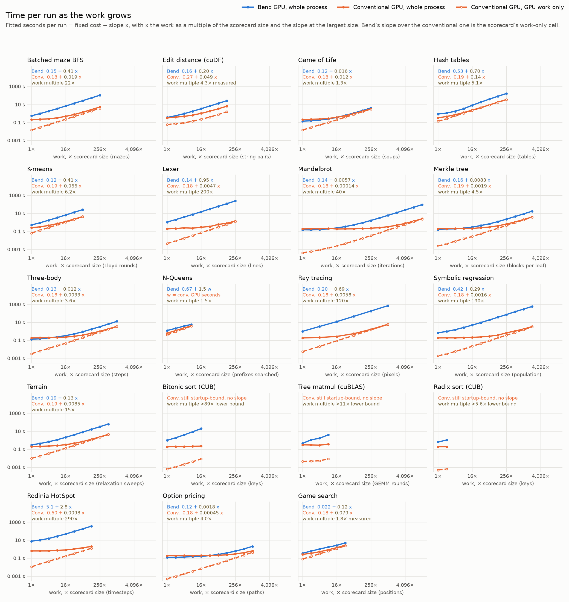
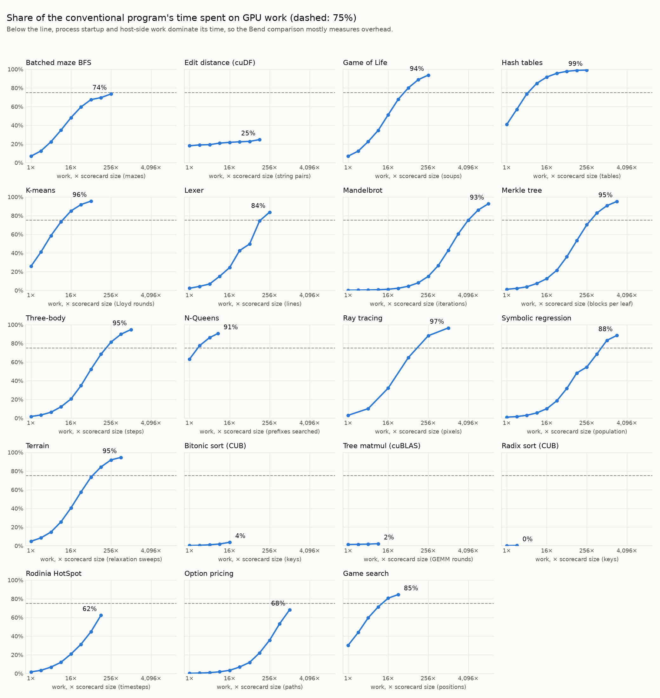

# Bend GPU against conventional GPU programs once startup stops dominating

At the scorecard sizes, most conventional GPU programs spend under 10% of their run on the GPU, inside about 0.2 s of process startup, so the scorecard's GPU columns mostly compare startup. How much slower is Bend per unit of work once the work dominates?

Grown until the conventional GPU work dominates, Bend GPU takes a median 5.7× as long as the conventional program for each added unit of work, from 1.3× to 290×. Bend is closest on Game of Life (1.3×), N-Queens (1.5×), game search (1.8×), three-body (3.6×), option pricing (4.0×), edit distance (4.3×), Merkle trees (4.5×) and hash tables (5.1×), and furthest on HotSpot (290×), lexing (200×), symbolic regression (180×), ray tracing (120×) and Mandelbrot (40×). Bend's four wins at the scorecard sizes, Mandelbrot, Merkle, three-body and Game of Life, come from its faster startup and end at 8× to 32× the scorecard's work. For every other workload except N-Queens, the scorecard ratio understates the gap 2 to 50 times over: lexing goes from 5.7× at the scorecard size to 200× per unit of work.

Each Bend program and its conventional counterpart ran at doubling sizes along one work knob, in five alternating rounds per size, with outputs checked at every size. Each program's time was fitted as a fixed cost plus a work curve, and the comparison is Bend's added time for more work over the conventional program's, at the largest size measured.

## Results

The work-only ratio counts only what grows with the work. The fixed cost is the time a run takes with no work, mostly process startup: 0.12 to 0.20 s for Bend and 0.18 to 0.19 s for the conventional programs. Bend's is larger on hash tables, symbolic regression and N-Queens (0.4 to 0.7 s) and HotSpot (5.1 s); cuDF's is 0.27 s, N-Queens CUDA's 0.37 s and Rodinia HotSpot's 0.6 s. A change under 3% without the largest size means the ratio has settled. The ratios at the scorecard size come from this sweep's own 1× runs, under the same host load as its other sizes, and differ from the scorecard's by up to 10% (lexer 5.7× here, 6.2× in the scorecard).

| Workload | Work grown | Sizes | Bend ÷ conventional at the scorecard size | Bend ÷ conventional at the largest size | Conventional GPU share at the largest size | Work-only ratio | Change without the largest size | Fixed cost, Bend | Fixed cost, conventional |
|---|---|---:|---:|---:|---:|---:|---:|---:|---:|
| Batched maze BFS | mazes (2^depth) | 1× to 256× | 2.7× | 21× | 74% | 22× | -0.9% | 0.15 s | 0.18 s |
| Edit distance (cuDF) | string pairs (2^depth) | 1× to 128× | 1.1× | 4.1× | 25% | 4.3× | -4.7% | 0.16 s | 0.27 s |
| Game of Life | soups (2^depth) | 1× to 256× | 0.7× | 1.3× | 94% | 1.3× | -0.3% | 0.12 s | 0.18 s |
| Hash tables | tables (2^depth) | 1× to 256× | 2.6× | 4.7× | 99% | 5.1× | +2.6% | 0.53 s | 0.19 s |
| K-means | Lloyd rounds | 1× to 64× | 2.0× | 5.9× | 96% | 6.2× | -0.4% | 0.12 s | 0.19 s |
| Lexer | lines (2^depth) | 1× to 256× | 5.7× | 170× | 84% | 200× | +1.5% | 0.14 s | 0.18 s |
| Mandelbrot | iterations | 1× to 16,384× | 0.8× | 38× | 93% | 40× | +0.5% | 0.14 s | 0.18 s |
| Merkle tree | blocks per leaf | 1× to 2,048× | 0.8× | 4.4× | 95% | 4.5× | +0.1% | 0.16 s | 0.19 s |
| Three-body | simulation steps | 1× to 1,024× | 0.7× | 3.6× | 95% | 3.6× | +0.1% | 0.13 s | 0.18 s |
| Ray tracing | image side (pixels = k^2 x 6000 x 4096) | 1× to 32× | 5.4× | 120× | 97% | 120× | -1.1% | 0.2 s | 0.18 s |
| Symbolic regression | candidates (2^size) | 1× to 2,048× | 3.8× | 170× | 88% | 190× | -1.6% | 0.42 s | 0.18 s |
| Terrain | relaxation sweeps per tile | 1× to 512× | 1.5× | 14× | 95% | 15× | -0.0% | 0.19 s | 0.19 s |
| Rodinia HotSpot | timesteps on the 1,024 x 1,024 grid | 1× to 128× | 12× | 180× | 62% | 290× | -0.9% | 5.1 s | 0.6 s |
| Option pricing | paths per request (2^depth) | 1× to 1,024× | 0.6× | 3.2× | 68% | 4.0× | -1.9% | 0.12 s | 0.18 s |
| Game search | positions per batch (2^depth) | 1× to 32× | 1.4× | 1.9× | 85% | 1.8× | -0.9% | 0.022 s | 0.18 s |
| N-Queens | prefixes searched at 17 queens, then board size | 1× to board 19 | 2.0× | 1.4× | 99% | 1.5× |  | 0.67 s | 0.37 s |

| Library comparison | Largest size Bend's heap allows | Bend ÷ library there | Library GPU share there |
|---|---:|---:|---:|
| Bitonic sort (CUB) | 16× | 89× | 4% |
| Tree matmul (cuBLAS) | 8× | 11× | 2% |
| Radix sort (CUB) | 2× | 5.6× | 0% |

## Bend's startup wins end at 8× to 32× the scorecard's work

Bend finishes Mandelbrot, Merkle, three-body and Game of Life sooner at the scorecard sizes because those CUDA programs spend 0.8 to 14 ms on the GPU inside about 0.2 s, and Bend's fixed cost is 0.12 to 0.16 s against about 0.18 s. Bend stops finishing first at 16× the iterations for Mandelbrot, 8× the blocks per leaf for Merkle, 8× the steps for three-body and 32× the soups for Game of Life. Per unit of work, Game of Life is Bend's closest workload at 1.3×.

## The scorecard sizes hide the largest gaps

Lexing, symbolic regression, ray tracing and Mandelbrot all run their conventional GPU work in 0.8 to 6 ms at the scorecard size. Their ratios of 0.8 to 5.7 at that size grow to 40× to 200× per unit of work. HotSpot's 12× at the scorecard size hides two fixed costs, 0.6 s for Rodinia's CUDA program and 5.1 s for Bend, both spent before the first timestep. Past those, each timestep takes Bend about 27 ms and CUDA about 0.1 ms.

## Workload-specific knobs, limits and fits

- Hash tables: Bend's added time per 2,048 tables rises from 0.25 s to 0.59 s by 16× the tables, then levels off near 0.66 s, while CUDA's stays at 0.13 s. The fitted curve follows that plateau, giving 5.1×.
- Edit distance: cuDF generates its string pairs on the host, so its GPU share stays near 25% and its host time is counted as work. It is the one workload whose fit has not settled: 128× the pairs moved it from 4.4× to 4.2×, and 256× would overflow cuDF's 32-bit string offsets. Its five paired ratios at 128× range from 3.63 to 4.27, and Bend's added time over cuDF's for the last doubling is 4.33, so the table reports 4.3×.
- N-Queens: the prefix knob runs out at 8×, when the search covers every four-row prefix of 17 queens, so the sweep continues with 18 and 19 queens. With two knobs there is no single work axis, and Bend's time is fitted against CUDA's measured GPU time instead: 1.5×, from measured ratios of 1.37 to 1.64 at the largest sizes.
- Merkle by tree depth: the ratio rises from 0.83 at 2^22 leaves to 2.55 at 2^26, and 2^27 leaves ends in a Bend device fault when its 4 GB heap runs out. The per-leaf block count reaches the same range without the memory growth.
- Lexer by line length: longer lines raise the ratio from 5.9 to 29 at 8× the line length, and at 16× Bend stops with `memory fault (machine stack overflow?)`, the GPU stack limit that also stops UTS. Bend builds each line with one recursive call per character.
- Library comparisons: Bend's 4 GB heap faults at 2^28 bitonic sort keys, 2^24 radix sort keys and 16× the matmul rounds, while CUB and cuBLAS still spend under 5% of their run on the GPU. Their ratios are lower bounds.

## Bend GPU against Bend on 16 CPU threads

The same correction applies to moving one Bend program from the CPU to the GPU. At the scorecard sizes, Bend GPU's own fixed cost of 0.12 to 0.20 s is most of the run on several workloads, while an empty Bend program on the CPU runs in about 2 ms. Dividing the scorecard's 16-thread CPU time by Bend GPU's fitted time per unit of work at the largest size gives the per-work speedup:

| Workload | GPU speedup over 16 CPU threads at the scorecard size | Per unit of work |
|---|---:|---:|
| Merkle tree | 3.6× | 61× |
| Three-body | 4.7× | 50× |
| Game of Life | 5.5× | 47× |
| Mandelbrot | 2.8× | 24× |
| Edit distance | 1.3× | 2.0× |
| Terrain | 0.9× | 1.9× |
| Symbolic regression | 0.6× | 1.3× |
| K-means | 0.9× | 1.1× |
| Ray tracing | 0.7× | 1.0× |
| Batched maze BFS | 0.6× | 0.8× |
| Hash tables | 0.4× | 0.5× |
| Lexer | 0.3× | 0.4× |

This assumes the 16-thread CPU time grows in proportion to the work; the CPU sweep has not been run. Mandelbrot's row compares the published program on both chips, from the GPU sweep of 24 September, before the GPU comparison moved to the CUDA program's algorithm. HotSpot is left out because its CPU time includes parsing the input, which the GPU fit counts as fixed cost.

## CPU startup is 2 to 5 ms

The CPU columns need no such correction. On the same host, pinned to CPUs 0 to 15, as the median of 15 runs, an empty Bend 2.0.3 program (CPU build) takes 1.7 ms on one thread and 1.8 ms on 16, and an empty OpenMP program with one parallel region takes 5.0 ms and 5.2 ms ([measure.py](benchmarks/cpu-startup/measure.py), [results](benchmarks/cpu-startup/results.json)). That is under 0.1% of the one-thread scorecard cells and a few percent at most of all but the shortest 16-thread cells.

## Option pricing and game search

The scorecard times option pricing and game search per request or batch inside programs that keep running, so their process startup never enters its cells. Here they run as whole programs like every other workload: one quote of 262,144k paths, or one batch of 524,288k positions, per process. The conventional program's GPU work is its own timed compute region, since neither prints a CUDA event time.

- Option pricing: Bend finishes sooner up to about 34× the scorecard's paths, from its smaller fixed cost (0.12 s against 0.18 s). Per path, CUDA + CUB is 4.0× faster. That agrees with an earlier sweep of per-request times from 65,536 to 2^30 paths ([report](runs/pricing-crossover-20260920/report.md)), whose ratio settled at 4.2×.
- Game search: CUDA is faster at every size, with the ratio between 1.8× and 2.0× from 4× the positions on. Bend's added time per doubling is uneven, so the fitted slope at the largest size (1.6×) runs below the last doubling (1.9×); the table reports 1.8×. Both programs write out every answer, which is part of Bend's cost per position: timed only to the answers in host memory, CUDA is 3.7× faster per batch ([game-search results](MNK_HOST_ARRAY.md)).

The game-search CUDA control is the one-thread-per-position search with a fixed-depth recursion. The version in the scorecard until 25 September kept each GPU thread's recursion stack in local memory and ran 5-7× slower.
## Method

The runs use the scorecard's Bend revision, 2.0.3 ([b9d1352](https://github.com/bendlang/bend/commit/b9d1352c9f45632447f40a2e927355c92f2be58c)), and its conventional GPU programs. Each workload grows one knob by doubling multipliers k:

- Batched maze BFS: mazes, 2^19 × k.
- Edit distance: string pairs, 2^15 × k.
- Game of Life: soups, 2^24 × k, each run for 32 generations.
- Hash tables: tables of 16,384 operations, 2^11 × k.
- K-means: Lloyd rounds, 20 × k.
- Lexer: lines, 2^23 × k; separately, expression groups per line, 3 × k.
- Mandelbrot: escape iterations, 51 × k, on the fixed 4,096 × 4,096 image. The Bend side is [ports/mandelbrot-escape.bend](src/bend_bench/assets/ports/mandelbrot-escape.bend), which runs the CUDA program's algorithm: each pixel stops at escape, and one pass collects the histogram and the weighted sums. Bend's published program runs every iteration of every pixel and renders twice, and against it the sweep of 24 September measured 88× per iteration, most of it from that difference. Both give the same result at every size.
- Merkle: counter blocks encrypted per leaf, 30 × k, over 2^22 leaves; separately, tree depth.
- Three-body: simulation steps, 300 × k, over 2^20 systems.
- N-Queens: four-row prefixes searched at 17 queens, 11,730 × k up to all 83,521, then 18 and 19 queens.
- Ray tracing: image side, 6,000k × 4,096k pixels, so the work grows as k^2.
- Symbolic regression: candidates, 2^18 × k, each scored on 110 points.
- Terrain: relaxation sweeps per tile, 5 × k.
- Rodinia HotSpot: timesteps, 100 × k, on the 1,024 × 1,024 input.
- Option pricing: paths in the one quote each process computes, 262,144 × k, with 256 observations per path.
- Game search: positions in the one batch each process solves, 524,288 × k, from the 1,024-position 5 × 5 connect-4 corpus.
- Bitonic sort and radix sort: keys, 2^23 × k and 2^22 × k. Tree matmul: rounds of 128 × 128 GEMMs, 384 × k.

Bend GPU uses 32 host threads and a 4 GB heap, as in the scorecard. Times are complete-process wall time. Each size gets one untimed check and one warmup per implementation, then five rounds in which both run once in seeded random order. Tables report medians, and the conventional program's GPU time comes from its event timer. Running both sides alternately keeps them under the same load while other work shared the host.

At every size, Bend's printed checksum must equal the conventional program's. At smaller sizes, and wherever the per-size tables say so, the conventional program also ran in its verify mode, which checks every output against the serial C reference compiled into the same binary. HotSpot instead checks all 1,048,576 cells from both programs against the harness's scalar reference at every size, within its fixed tolerance. The Game of Life CUDA program has no verify mode, so its sizes rely on agreement with the independent Bend implementation.

The sweep's copies of the conventional programs differ from the scorecard's only where larger sizes require it. Argument caps are raised. The Merkle leaf loop counts its blocks as the serial `block_chain` does, since the original bound `(b + 1) * BLOCKS` wraps past 2^32 from 64× the blocks. Hash tables run the original kernels over chunks of at most 2,048 tables, the scorecard's count, because the original grid has one row per table. Ray tracing indexes pixels with 64 bits, and k-means and the lexer's line buffers take their sizes from the knob. Bend 2.0.3 expands a Nat literal into a chain of nodes, so multipliers above 64 are written as products such as `Nat.mul(64n, 64n)`.

### Fitting

Both programs' times are fitted against the work x, as a multiple of the scorecard size, with least squares on log time so every size counts by relative error:

- The conventional program's time is rebuilt at each size from its measured GPU time plus a line through its host-side time, the process time minus the GPU time. Host load only adds time, so each size's host time is its fastest measured round, and the line is a Theil-Sen fit through those minimums. The line is flat for most programs and rises where the host side does real work, as in cuDF's input generation. This removes load spikes of up to 0.6 s that otherwise land in a 1 to 2 s process time.
- Each program's time is fitted as a + d·x + b·x^c. The d·x term is the work at scale. The b·x^c term, of either sign, absorbs the curvature of small sizes, where the GPU is still filling or data still fits in cache.
- The work-only ratio is the slope of Bend's curve over the slope of the conventional curve, at the largest size measured.
- The fixed costs come from the simpler a + b·x^c, because the extra term trades off against a.

A workload stopped growing once its work-only ratio changed by less than 3% when the newest size was left out and its conventional GPU work was at least half of its process time, or at its largest valid size. Edit distance is exempt from the GPU share requirement, since cuDF's host-side generation keeps its share near 25%.

## Evidence

The sweeps are produced by [startup_scaling.py](startup_scaling.py), the fits and these tables by [scaling_fit.py](scaling_fit.py) and the charts in [benchmarks/startup-scaling](benchmarks/startup-scaling) by [scaling_charts.py](scaling_charts.py). Each run directory under `runs/startup-scaling-*` keeps the generated Bend and conventional sources, build logs and every sample, including failed attempts:

- The first Merkle blocks pass stopped at 64× when the unmodified CUDA loop disagreed with Bend.
- One Mandelbrot pass stopped when the 8,192 literal overflowed the Bend compiler.
- Merkle by depth stopped at 2^27 leaves with a Bend device fault.
- The lexer by line length stopped at 16× with Bend's GPU stack overflow.
- HotSpot at 260× stopped when an unapproved GPU process started during a measured Bend run. Its check and warmup had passed.
- The first game-search sweep, `20260925-165430`, used the CUDA control with the local-memory recursion; `20260925-172353` replaces it with the fixed control.
- Three runs ended without their completion record when their service was stopped: `20260924-104254`, `20260924-134639` and `20260924-144502`. Every size they finished is used.

## All sizes

### Batched maze BFS

| Multiplier | mazes (2^depth) | Bend GPU seconds | Conventional seconds | Conventional GPU seconds | Conventional host floor seconds | Bend ÷ conventional | Checked against serial C |
|---:|---:|---:|---:|---:|---:|---:|---|
| 1× | 19 | 0.549 | 0.203 | 0.0141 | 0.185 | 2.7× | yes |
| 2× | 20 | 0.961 | 0.223 | 0.0282 | 0.192 | 4.3× | yes |
| 4× | 21 | 1.77 | 0.253 | 0.0567 | 0.195 | 7.0× | yes |
| 8× | 22 | 3.39 | 0.322 | 0.112 | 0.208 | 10× | yes |
| 16× | 23 | 6.68 | 0.47 | 0.227 | 0.236 | 14× | yes |
| 32× | 24 | 13.3 | 0.764 | 0.456 | 0.294 | 17× | no |
| 64× | 25 | 26.4 | 1.36 | 0.92 | 0.415 | 19× | no |
| 128× | 26 | 52.6 | 2.67 | 1.86 | 0.635 | 20× | no |
| 256× | 27 | 105 | 5.11 | 3.76 | 1.1 | 21× | no |

### Edit distance (cuDF)

| Multiplier | string pairs (2^depth) | Bend GPU seconds | Conventional seconds | Conventional GPU seconds | Conventional host floor seconds | Bend ÷ conventional | Checked against serial C |
|---:|---:|---:|---:|---:|---:|---:|---|
| 1× | 15 | 0.353 | 0.323 | 0.0584 | 0.256 | 1.1× | yes |
| 2× | 16 | 0.556 | 0.385 | 0.0733 | 0.293 | 1.4× | yes |
| 4× | 17 | 0.939 | 0.468 | 0.0904 | 0.371 | 2.0× | yes |
| 8× | 18 | 1.74 | 0.651 | 0.136 | 0.506 | 2.7× | yes |
| 16× | 19 | 3.36 | 1.01 | 0.221 | 0.78 | 3.3× | yes |
| 32× | 20 | 6.68 | 1.77 | 0.395 | 1.35 | 3.8× | no |
| 64× | 21 | 13.1 | 3.31 | 0.755 | 2.5 | 4.0× | no |
| 128× | 22 | 26.2 | 6.32 | 1.56 | 4.61 | 4.1× | no |

### Game of Life

| Multiplier | soups (2^depth) | Bend GPU seconds | Conventional seconds | Conventional GPU seconds | Conventional host floor seconds | Bend ÷ conventional | Checked against serial C |
|---:|---:|---:|---:|---:|---:|---:|---|
| 1× | 18 | 0.136 | 0.204 | 0.0144 | 0.186 | 0.7× | no |
| 2× | 19 | 0.156 | 0.222 | 0.0275 | 0.185 | 0.7× | no |
| 4× | 20 | 0.187 | 0.239 | 0.054 | 0.176 | 0.8× | no |
| 8× | 21 | 0.24 | 0.274 | 0.0949 | 0.176 | 0.9× | no |
| 16× | 22 | 0.362 | 0.369 | 0.189 | 0.178 | 1.0× | no |
| 32× | 23 | 0.61 | 0.563 | 0.382 | 0.18 | 1.1× | no |
| 64× | 24 | 1.11 | 0.955 | 0.763 | 0.182 | 1.2× | no |
| 128× | 25 | 2.09 | 1.72 | 1.53 | 0.187 | 1.2× | no |
| 256× | 26 | 4.1 | 3.27 | 3.07 | 0.196 | 1.3× | no |

### Hash tables

| Multiplier | tables (2^depth) | Bend GPU seconds | Conventional seconds | Conventional GPU seconds | Conventional host floor seconds | Bend ÷ conventional | Checked against serial C |
|---:|---:|---:|---:|---:|---:|---:|---|
| 1× | 11 | 0.856 | 0.325 | 0.133 | 0.19 | 2.6× | yes |
| 2× | 12 | 1.1 | 0.457 | 0.261 | 0.188 | 2.4× | yes |
| 4× | 13 | 1.76 | 0.725 | 0.534 | 0.187 | 2.4× | yes |
| 8× | 14 | 3.38 | 1.24 | 1.06 | 0.187 | 2.7× | yes |
| 16× | 15 | 8.11 | 2.34 | 2.15 | 0.187 | 3.5× | yes |
| 32× | 16 | 18.1 | 4.46 | 4.27 | 0.192 | 4.0× | no |
| 64× | 17 | 38.8 | 8.83 | 8.64 | 0.191 | 4.4× | no |
| 128× | 18 | 80.8 | 17.8 | 17.6 | 0.201 | 4.5× | no |
| 256× | 19 | 165 | 35.1 | 34.7 | 0.288 | 4.7× | no |

### K-means

| Multiplier | Lloyd rounds | Bend GPU seconds | Conventional seconds | Conventional GPU seconds | Conventional host floor seconds | Bend ÷ conventional | Checked against serial C |
|---:|---:|---:|---:|---:|---:|---:|---|
| 1× | 20 | 0.516 | 0.255 | 0.0659 | 0.188 | 2.0× | yes |
| 2× | 40 | 0.908 | 0.32 | 0.132 | 0.185 | 2.8× | yes |
| 4× | 80 | 1.72 | 0.45 | 0.264 | 0.184 | 3.8× | yes |
| 8× | 160 | 3.35 | 0.72 | 0.529 | 0.182 | 4.7× | yes |
| 16× | 320 | 6.62 | 1.24 | 1.06 | 0.183 | 5.3× | yes |
| 32× | 640 | 13.2 | 2.31 | 2.12 | 0.188 | 5.7× | no |
| 64× | 1,280 | 26.3 | 4.43 | 4.23 | 0.193 | 5.9× | no |

### Lexer

| Multiplier | lines (2^depth) | Bend GPU seconds | Conventional seconds | Conventional GPU seconds | Conventional host floor seconds | Bend ÷ conventional | Checked against serial C |
|---:|---:|---:|---:|---:|---:|---:|---|
| 1× | 23 | 1.08 | 0.19 | 0.0044 | 0.183 | 5.7× | yes |
| 2× | 24 | 2.02 | 0.206 | 0.00886 | 0.182 | 9.8× | yes |
| 4× | 25 | 3.91 | 0.247 | 0.017 | 0.186 | 16× | yes |
| 8× | 26 | 7.65 | 0.227 | 0.0341 | 0.186 | 34× | yes |
| 16× | 27 | 15.2 | 0.29 | 0.0709 | 0.188 | 52× | yes |
| 32× | 28 | 30.3 | 0.344 | 0.147 | 0.184 | 88× | no |
| 64× | 29 | 60.2 | 0.594 | 0.295 | 0.181 | 100× | no |
| 128× | 30 | 121 | 0.795 | 0.592 | 0.188 | 150× | no |
| 256× | 31 | 242 | 1.42 | 1.19 | 0.18 | 170× | no |

### Mandelbrot

| Multiplier | iterations | Bend GPU seconds | Conventional seconds | Conventional GPU seconds | Conventional host floor seconds | Bend ÷ conventional | Checked against serial C |
|---:|---:|---:|---:|---:|---:|---:|---|
| 1× | 51 | 0.15 | 0.19 | 0.000423 | 0.182 | 0.8× | yes |
| 2× | 102 | 0.146 | 0.196 | 0.000577 | 0.186 | 0.8× | yes |
| 4× | 204 | 0.161 | 0.192 | 0.00087 | 0.189 | 0.8× | yes |
| 8× | 408 | 0.192 | 0.213 | 0.00145 | 0.195 | 0.9× | yes |
| 16× | 816 | 0.24 | 0.185 | 0.00229 | 0.176 | 1.3× | yes |
| 32× | 1,632 | 0.34 | 0.19 | 0.00437 | 0.176 | 1.8× | no |
| 64× | 3,264 | 0.536 | 0.191 | 0.00847 | 0.181 | 2.8× | no |
| 128× | 6,528 | 0.898 | 0.208 | 0.0168 | 0.178 | 4.3× | no |
| 256× | 13,056 | 1.64 | 0.223 | 0.0334 | 0.185 | 7.3× | no |
| 512× | 26,112 | 3.11 | 0.26 | 0.0691 | 0.188 | 12× | no |
| 1,024× | 52,224 | 6.03 | 0.33 | 0.141 | 0.18 | 18× | no |
| 2,048× | 104,448 | 12 | 0.473 | 0.286 | 0.185 | 25× | no |
| 4,096× | 208,896 | 23.8 | 0.766 | 0.577 | 0.182 | 31× | no |
| 8,192× | 417,792 | 47.5 | 1.36 | 1.17 | 0.181 | 35× | no |
| 16,384× | 835,584 | 94.9 | 2.53 | 2.35 | 0.181 | 38× | no |

### Merkle tree

| Multiplier | blocks per leaf | Bend GPU seconds | Conventional seconds | Conventional GPU seconds | Conventional host floor seconds | Bend ÷ conventional | Checked against serial C |
|---:|---:|---:|---:|---:|---:|---:|---|
| 1× | 30 | 0.163 | 0.199 | 0.00236 | 0.188 | 0.8× | yes |
| 2× | 60 | 0.187 | 0.194 | 0.0042 | 0.186 | 1.0× | yes |
| 4× | 120 | 0.191 | 0.21 | 0.00802 | 0.192 | 0.9× | yes |
| 8× | 240 | 0.228 | 0.208 | 0.0155 | 0.176 | 1.1× | yes |
| 16× | 480 | 0.292 | 0.212 | 0.0267 | 0.183 | 1.4× | yes |
| 32× | 960 | 0.448 | 0.252 | 0.0545 | 0.185 | 1.8× | no |
| 64× | 1,920 | 0.69 | 0.302 | 0.109 | 0.188 | 2.3× | yes |
| 128× | 3,840 | 1.22 | 0.416 | 0.222 | 0.181 | 2.9× | no |
| 256× | 7,680 | 2.28 | 0.643 | 0.452 | 0.188 | 3.6× | no |
| 512× | 15,360 | 4.43 | 1.11 | 0.92 | 0.187 | 4.0× | no |
| 1,024× | 30,720 | 8.77 | 2.06 | 1.87 | 0.183 | 4.3× | no |
| 2,048× | 61,440 | 17.4 | 3.95 | 3.76 | 0.18 | 4.4× | no |

### Three-body

| Multiplier | simulation steps | Bend GPU seconds | Conventional seconds | Conventional GPU seconds | Conventional host floor seconds | Bend ÷ conventional | Checked against serial C |
|---:|---:|---:|---:|---:|---:|---:|---|
| 1× | 300 | 0.134 | 0.187 | 0.00327 | 0.183 | 0.7× | yes |
| 2× | 600 | 0.149 | 0.192 | 0.00639 | 0.183 | 0.8× | yes |
| 4× | 1,200 | 0.184 | 0.201 | 0.0126 | 0.182 | 0.9× | yes |
| 8× | 2,400 | 0.238 | 0.208 | 0.0251 | 0.177 | 1.1× | yes |
| 16× | 4,800 | 0.332 | 0.228 | 0.0466 | 0.178 | 1.5× | no |
| 32× | 9,600 | 0.514 | 0.281 | 0.0976 | 0.177 | 1.8× | no |
| 64× | 19,200 | 0.895 | 0.38 | 0.199 | 0.18 | 2.4× | no |
| 128× | 38,400 | 1.7 | 0.601 | 0.411 | 0.181 | 2.8× | no |
| 256× | 76,800 | 3.26 | 1.01 | 0.82 | 0.184 | 3.2× | no |
| 512× | 153,600 | 6.4 | 1.86 | 1.67 | 0.184 | 3.4× | no |
| 1,024× | 307,200 | 12.8 | 3.56 | 3.37 | 0.179 | 3.6× | no |

### Ray tracing

| Multiplier | image side (pixels = k^2 x 6000 x 4096) | Bend GPU seconds | Conventional seconds | Conventional GPU seconds | Conventional host floor seconds | Bend ÷ conventional | Checked against serial C |
|---:|---:|---:|---:|---:|---:|---:|---|
| 1× | 6,000 | 0.995 | 0.185 | 0.0056 | 0.178 | 5.4× | yes |
| 2× | 12,000 | 3.49 | 0.207 | 0.021 | 0.177 | 17× | yes |
| 4× | 24,000 | 11.9 | 0.27 | 0.0867 | 0.179 | 44× | no |
| 8× | 48,000 | 46.3 | 0.549 | 0.355 | 0.181 | 84× | no |
| 16× | 96,000 | 181 | 1.64 | 1.45 | 0.193 | 110× | no |
| 32× | 192,000 | 713 | 6.09 | 5.88 | 0.191 | 120× | no |

### Symbolic regression

| Multiplier | candidates (2^size) | Bend GPU seconds | Conventional seconds | Conventional GPU seconds | Conventional host floor seconds | Bend ÷ conventional | Checked against serial C |
|---:|---:|---:|---:|---:|---:|---:|---|
| 1× | 18 | 0.696 | 0.185 | 0.0019 | 0.181 | 3.8× | yes |
| 2× | 19 | 0.963 | 0.189 | 0.00313 | 0.181 | 5.1× | yes |
| 4× | 20 | 1.53 | 0.189 | 0.00573 | 0.178 | 8.1× | yes |
| 8× | 21 | 2.67 | 0.198 | 0.011 | 0.185 | 13× | yes |
| 16× | 22 | 4.89 | 0.215 | 0.0217 | 0.185 | 23× | yes |
| 32× | 23 | 9.47 | 0.238 | 0.0441 | 0.187 | 40× | no |
| 64× | 24 | 18.3 | 0.284 | 0.0904 | 0.188 | 64× | no |
| 128× | 25 | 36.7 | 0.379 | 0.183 | 0.19 | 97× | no |
| 256× | 26 | 73 | 0.675 | 0.369 | 0.205 | 110× | no |
| 512× | 27 | 151 | 1.08 | 0.741 | 0.324 | 140× | no |
| 1,024× | 28 | 294 | 1.79 | 1.49 | 0.256 | 160× | no |
| 2,048× | 29 | 580 | 3.37 | 2.99 | 0.368 | 170× | no |

### Terrain

| Multiplier | relaxation sweeps per tile | Bend GPU seconds | Conventional seconds | Conventional GPU seconds | Conventional host floor seconds | Bend ÷ conventional | Checked against serial C |
|---:|---:|---:|---:|---:|---:|---:|---|
| 1× | 5 | 0.308 | 0.203 | 0.0098 | 0.184 | 1.5× | yes |
| 2× | 10 | 0.436 | 0.207 | 0.0177 | 0.188 | 2.1× | yes |
| 4× | 20 | 0.68 | 0.228 | 0.0337 | 0.187 | 3.0× | yes |
| 8× | 40 | 1.14 | 0.257 | 0.0661 | 0.184 | 4.4× | yes |
| 16× | 80 | 2.11 | 0.323 | 0.131 | 0.187 | 6.5× | yes |
| 32× | 160 | 4.12 | 0.457 | 0.264 | 0.183 | 9.0× | no |
| 64× | 320 | 8.08 | 0.721 | 0.53 | 0.186 | 11× | no |
| 128× | 640 | 16.2 | 1.27 | 1.07 | 0.194 | 13× | no |
| 256× | 1,280 | 32.1 | 2.34 | 2.16 | 0.185 | 14× | no |
| 512× | 2,560 | 64.1 | 4.55 | 4.31 | 0.189 | 14× | no |

### Rodinia HotSpot

| Multiplier | timesteps on the 1,024 x 1,024 grid | Bend GPU seconds | Conventional seconds | Conventional GPU seconds | Conventional host floor seconds | Bend ÷ conventional | Checked against serial C |
|---:|---:|---:|---:|---:|---:|---:|---|
| 1× | 100 | 7.88 | 0.644 | 0.0112 | 0.611 | 12× | yes |
| 2× | 200 | 10.4 | 0.644 | 0.0223 | 0.604 | 16× | yes |
| 4× | 400 | 15.5 | 0.646 | 0.0445 | 0.591 | 24× | yes |
| 8× | 800 | 27.3 | 0.737 | 0.0889 | 0.594 | 37× | yes |
| 16× | 1,600 | 49.2 | 0.826 | 0.173 | 0.627 | 60× | yes |
| 32× | 3,200 | 94.2 | 1.06 | 0.333 | 0.598 | 89× | yes |
| 64× | 6,400 | 184 | 1.44 | 0.643 | 0.639 | 130× | yes |
| 128× | 12,800 | 359 | 2.02 | 1.26 | 0.626 | 180× | yes |

### Option pricing

| Multiplier | paths per request (2^depth) | Bend GPU seconds | Conventional seconds | Conventional GPU seconds | Conventional host floor seconds | Bend ÷ conventional | Checked against serial C |
|---:|---:|---:|---:|---:|---:|---:|---|
| 1× | 18 | 0.121 | 0.189 | 0.00053 | 0.183 | 0.6× | yes |
| 2× | 19 | 0.127 | 0.189 | 0.000933 | 0.183 | 0.7× | yes |
| 4× | 20 | 0.136 | 0.195 | 0.0018 | 0.185 | 0.7× | yes |
| 8× | 21 | 0.147 | 0.189 | 0.00353 | 0.185 | 0.8× | yes |
| 16× | 22 | 0.159 | 0.203 | 0.00695 | 0.183 | 0.8× | yes |
| 32× | 23 | 0.196 | 0.198 | 0.0138 | 0.183 | 1.0× | no |
| 64× | 24 | 0.259 | 0.21 | 0.0251 | 0.179 | 1.2× | no |
| 128× | 25 | 0.392 | 0.237 | 0.0526 | 0.177 | 1.7× | no |
| 256× | 26 | 0.598 | 0.301 | 0.107 | 0.185 | 2.0× | no |
| 512× | 27 | 1.09 | 0.412 | 0.219 | 0.189 | 2.6× | no |
| 1,024× | 28 | 2.06 | 0.65 | 0.443 | 0.202 | 3.2× | no |

### Game search

| Multiplier | positions per batch (2^depth) | Bend GPU seconds | Conventional seconds | Conventional GPU seconds | Conventional host floor seconds | Bend ÷ conventional | Checked against serial C |
|---:|---:|---:|---:|---:|---:|---:|---|
| 1× | 19 | 0.364 | 0.268 | 0.0814 | 0.186 | 1.4× | yes |
| 2× | 20 | 0.608 | 0.348 | 0.153 | 0.19 | 1.7× | yes |
| 4× | 21 | 1.06 | 0.523 | 0.312 | 0.199 | 2.0× | yes |
| 8× | 22 | 1.7 | 0.861 | 0.614 | 0.243 | 2.0× | yes |
| 16× | 23 | 2.67 | 1.48 | 1.19 | 0.285 | 1.8× | yes |
| 32× | 24 | 5.14 | 2.77 | 2.34 | 0.419 | 1.9× | yes |

### Bitonic sort (CUB)

| Multiplier | keys (2^depth) | Bend GPU seconds | Conventional seconds | Conventional GPU seconds | Conventional host floor seconds | Bend ÷ conventional | Checked against serial C |
|---:|---:|---:|---:|---:|---:|---:|---|
| 1× | 23 | 0.977 | 0.192 | 0.000628 | 0.19 | 5.1× | yes |
| 2× | 24 | 1.89 | 0.199 | 0.00114 | 0.187 | 9.5× | yes |
| 4× | 25 | 3.95 | 0.193 | 0.00214 | 0.19 | 20× | yes |
| 8× | 26 | 8.77 | 0.213 | 0.00418 | 0.19 | 41× | yes |
| 16× | 27 | 19.7 | 0.221 | 0.00832 | 0.209 | 89× | yes |

### Tree matmul (cuBLAS)

| Multiplier | rounds of 128x128 GEMMs | Bend GPU seconds | Conventional seconds | Conventional GPU seconds | Conventional host floor seconds | Bend ÷ conventional | Checked against serial C |
|---:|---:|---:|---:|---:|---:|---:|---|
| 1× | 384 | 0.454 | 0.312 | 0.00438 | 0.273 | 1.5× | yes |
| 2× | 768 | 1.11 | 0.297 | 0.00478 | 0.269 | 3.7× | yes |
| 4× | 1,536 | 1.69 | 0.286 | 0.00528 | 0.275 | 5.9× | yes |
| 8× | 3,072 | 3.93 | 0.366 | 0.00838 | 0.295 | 11× | yes |

### Radix sort (CUB)

| Multiplier | keys (2^depth) | Bend GPU seconds | Conventional seconds | Conventional GPU seconds | Conventional host floor seconds | Bend ÷ conventional | Checked against serial C |
|---:|---:|---:|---:|---:|---:|---:|---|
| 1× | 22 | 0.635 | 0.19 | 0.000494 | 0.184 | 3.3× | yes |
| 2× | 23 | 1.07 | 0.192 | 0.000627 | 0.187 | 5.6× | yes |

### N-Queens, prefixes searched at 17 queens

| Multiplier | four-row prefixes searched | Bend GPU seconds | Conventional seconds | Conventional GPU seconds | Conventional host floor seconds | Bend ÷ conventional | Checked against serial C |
|---:|---:|---:|---:|---:|---:|---:|---|
| 1× | 11,730 | 1.23 | 0.618 | 0.39 | 0.222 | 2.0× | yes |
| 2× | 23,460 | 2.12 | 1.19 | 0.922 | 0.263 | 1.8× | yes |
| 4× | 46,920 | 3.82 | 2.39 | 2.06 | 0.321 | 1.6× | yes |
| 8× | 83,521 | 5.81 | 3.98 | 3.61 | 0.368 | 1.5× | yes |

### N-Queens, board size

| Multiplier | board size, every four-row prefix | Bend GPU seconds | Conventional seconds | Conventional GPU seconds | Conventional host floor seconds | Bend ÷ conventional | Checked against serial C |
|---:|---:|---:|---:|---:|---:|---:|---|
| 1× | 17 | 5.74 | 3.8 | 3.43 | 0.369 | 1.5× | yes |
| 2× | 18 | 43.2 | 26.3 | 25.7 | 0.547 | 1.6× | no |
| 4× | 19 | 278 | 202 | 201 | 0.985 | 1.4× | no |

### Merkle tree, by tree depth

| Multiplier | tree depth | Bend GPU seconds | Conventional seconds | Conventional GPU seconds | Conventional host floor seconds | Bend ÷ conventional | Checked against serial C |
|---:|---:|---:|---:|---:|---:|---:|---|
| 1× | 22 | 0.162 | 0.194 | 0.00244 | 0.187 | 0.8× | yes |
| 2× | 23 | 0.183 | 0.194 | 0.00434 | 0.188 | 0.9× | yes |
| 4× | 24 | 0.259 | 0.216 | 0.00752 | 0.183 | 1.2× | yes |
| 8× | 25 | 0.373 | 0.22 | 0.0145 | 0.18 | 1.7× | yes |
| 16× | 26 | 0.573 | 0.224 | 0.0287 | 0.191 | 2.6× | yes |

### Lexer, by line length

| Multiplier | expression groups per line | Bend GPU seconds | Conventional seconds | Conventional GPU seconds | Conventional host floor seconds | Bend ÷ conventional | Checked against serial C |
|---:|---:|---:|---:|---:|---:|---:|---|
| 1× | 3 | 1.09 | 0.186 | 0.00437 | 0.175 | 5.9× | yes |
| 2× | 6 | 1.93 | 0.192 | 0.00953 | 0.18 | 10× | yes |
| 4× | 12 | 3.63 | 0.216 | 0.0211 | 0.189 | 17× | yes |
| 8× | 24 | 7.09 | 0.243 | 0.0502 | 0.186 | 29× | yes |
